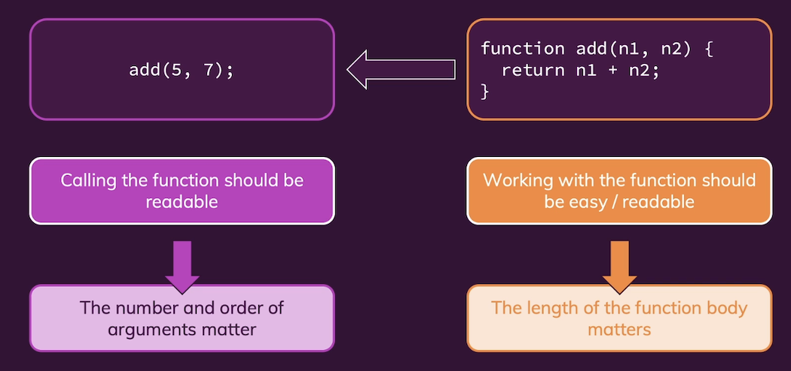
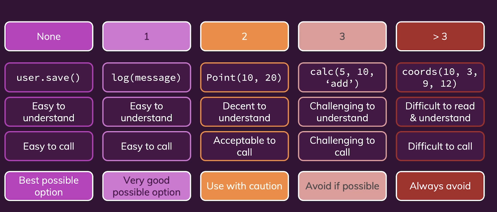

<br/>

---

## 목차

- [Ch01. Getting Started](#ch01-getting-started) <br/>
- [Ch02. Naming](#ch02-naming) <br/>
- [Ch03. Code Structure and Formatting](#ch03-code-structure-and-formatting) <br/>
- [Ch04. Functions and Methods](#ch04-functions-and-methods) <br/>


<br/>

---

## Ch01. Getting Started

<br/>

### 01. 가독성을 위해 모든 변수에 type 명을 표기해야하나요?

```python
//types
function add(num1: number, num2: number) {
  retrun num1 + num2;
}

//without types
def add(num1, num2):
  return num1 + num2
```
- 그렇지 않습니다. clean code는 Strong typing 을 필요로 하지 않습니다
- 타입을 써주는 이유는 가독성도 있지만 주된 이유는 에러를 피하기 위해서입니다
- 클린 코드로 적으면 타입을 적어주지 않더라도 가독성과 에러 회피 두 마리 토끼를 잡으면서도 간결하게 코드 작성이 가능해집니다

#

### 02. Clean Code 에서는 아키텍쳐를 다루는 것인가요?

&nbsp;&nbsp;&nbsp;&nbsp;<br/>

- 클린 코드와 클린 아키텍쳐는 다른 범위입니다
- 클린 코드는 **어떻게(How)** 작성하는지 포커스를 둡니다. 
- 클린 아키텍쳐는 code를 **어디에(Where)** 작성하는지 포커스를 둡니다

#

### 03. 왜 클린코드를 작성해야하나요?

&nbsp;&nbsp;&nbsp;&nbsp;<br/>

- Dirty code를 작성하면 빠르게 작성할 수는 있습니다
- 하지만 나중에 유지보수나 버그를 잡는 순간이 오게되면 시간이 훨씬 더 많이 걸리게 됩니다.
- 반면 클린코드를 작성하면 초반에는 시간이 걸릴 수 있으나 나중에가서는 버그를 잡거나 유지보수함에 있어 오히려 시간을 절약하게 됩니다

<br>

--- 

## Ch02. Naming

<br/>

### 01. 왜 의미있는 Naming 이 중요한가요?

```python
//bad exmaple
const us = new MainEntity();
us.process();

if (login) {
  //...
}

//Meangingful Naming
const user = new User();
user.save();

if (isLoggedIn) {
  //...
}
```
- Naming이 Meaningful하면 내용물을 굳이 들여다보지않더라도 의미를 짐작할 수 있습니다
- 읽는사람으로 하여금 코드에 대한 이해도를 빠른시간에 높일 수 있습니다

#

### 02. Variables & Constants 는 어떻게 네이밍하는 것이 좋을까요?

```Javascript
const userData = {...}
const isValid = true
```

- Variables & Constants는 주로 입력값이나, 결과등 데이터 컨테이너입니다.
- 이러한 Variables & Constants에는 **명사형**으로 써주거나 형용사를 사용한 짧은 phrases로 네이밍합니다.

#

### 03. Function / Methods 는 어떻게 네이밍하는 것이 좋을까요?

```python
sendData()
inputIsValid()
```

- Function / Methods는 data를 서버에 보내라 같은 특정 명령이나 인풋값을 bool로 검증하기 등 value를 계산합니다.
- 이러한 unction / Methods 주로 **동사형**을 써주거나 형용사를 사용한 짧은 phrases로 네이밍합니다.

#

### 04. Class는 어떻게 네이밍하는 것이 좋을까요?

```python
class User { ... }
class RequestBody { ... } //combination nouns
```
- class는 주로 user, product, http request body 등 things를 만들 때 사용합니다
- Class는 **명사형**으로 네이밍합니다

#

### 05. variabe을 네이밍할 때 타입에 따라 어떻게 네이밍하면 좋을까요?

- 변수나 속성의 타입이 object, number or string이라면 내용물을 명사로 적어줍니다 (ex. user, database, name, age)
- 만약 좀더 디테일한 정보를 담고 싶다면 명사형을 조합해줍니다(ex. authenticatedUser, sqlDatabase, firstName, age)
- 변수나 속성의 타입이 bool이라면 네이밍에 대한 답이 true/false가 되야합니다(ex. isActive, loggenIn)

#

### 06. variabe을 네이밍할 때 주의해야할 점이 어떤 것이 있을까요?

- Variable에 어떤 데이터를 저장했는지 specific하게 담겨야합니다
- 그냥 `you`, `data`는 너무 광범위합니다. 대신에 `userData`, `person`과 같이 내용물을 Specific하게 네이밍해주어야 합니다.
- 하지만 `userData`, `person` 는 redundant하거나 불분명합니다. 대신에 `user`, `customer`로 네이밍해주는 것이 좋습니다.
- Bool타입을 네이밍할경우 descriptive하게 적어줌으로서 Bool타입이라는 것을 네이밍을 통해 알려주는 것이 좋습니다
- 예를들어 단순히 `correct`, `validatedInput`보다는 `isCorrect`, `isValid`라고 적어주는 것이 좋습니다.

#

### 07. Functinos & method를 네이밍할 때 주의해야할 점이 어떤 것이 있을까요?

- function에는 작업을 동사형으로 묘사해줍니다 -> `getUser(...)`, `response.send()`
- 이때 Boolen을 계산하는 function에는 descriptive하게 네이밍합니다 -> `isValid(...)`, `purchase.isPaid()`
- 좋은 네이밍을 할 때는 질문하는 것이 좋습니다. 무엇을 process하는거지? 무엇을 save하는거지? 무얼 의도하는거지 (ex. `process()` -> `save()` -> `saveUser()`) 

#

### 08. Class를 네이밍할 때 주의할 점은 어떤 것이 있을까요?

&nbsp;&nbsp;&nbsp;&nbsp;<br/>

- Class는 중복되는 정보가 있으면 안됩니다
- 예를들어 `class UserOBJ` 대신에 `class User`로 이름짓는 것이 좋습니다
- 또한 클래스 내에 메서드들이 서로 distinctive 해야합니다. 사진과 같이 무논리로 나열해버리면 나중에 버그찾기가 매우 힘들어집니다

#

### 09. 네이밍할 때 일관성을 지켜야한다는 것이 어떤 뜻인가요?

```python
database = Database()

database.get_users()

database.get_products() //in line with get_users()

database.fetch_products() // ??? what the..?
```

- 전체적인 프로그램에서 네이밍함에 있어 일정한 네이밍 규칙을 적용해야합니다
- 예를들어 `get`을 썼으면 일관되게 `get`을 적용하게 `fetch`는 지양합니다

#

### 10. 아래 읽기 힘든 `BlogPost()` 클래스의 네이밍을 다시해주세요

```python
class BlogPost:
  def __init__(self, title, description, ymdhm):
    self.title = title
    self.description = description
    self.ymdhm = ymdhm

  def output(item):
    print('Title: ' + item.title)
    print('Description: ' + item.description)
    print('Published: ' + item.ymdhm)

summary = 'Clean Code Is Great'
desc = 'Actually, writing Clean code can be pretty fun.'
new_date = datetime.now()
publish = new_date.strftime('%Y-%m-%d %H:%M')

item = BlogPost(summary, desc, publish)

output(item)
```

- `ymdhm`(년월일시간분)같은 축약어는 알아보기 힘들기 때문에 `date`로 바꿔줍니다. 하지만 어떤 `date`인데? 라는 물음에 답하기 위해 `date_published`로 구체화해줍니다.
- `output()`은 그래서 어떤 output인지에 대해 불명확하므로 `print_blog_post()`처럼 구체화해줍니다. 이를 통해 아 얘는 블로그 포스트를 프린트하는 함수구나를 쉽게 알 수 있습니다.
- `item`대신에 구체적으로 `blog_post`로 바꾸어준뒤 같은 범위내 네이밍의 통일성을 부여해줍니다. `item.title` -> `blog_post.title`, `item.description` -> `blog_post.description`, `item.ymdhm` -> `blog_post.date_published`
- `summary`에 담긴 내용물은 제목이기 때문에 `title`로 바꿔줍니다
- `desc`같은 축약어는 지양합니다 `decription`으로 바꿔줍니다.
- `new_today`처럼 애매모호한 네이밍보다는 `now`와 같은 직관적인 네이밍으로 바꿔줍니다
- `publish`는 동사형이기 때문에 명령문처럼 보입니다. 이는 변수 네이밍의 나쁜예로 data container의 특성을 살려주는 명사형으로 `formatted_date`로 바꿔줍니다.
- 마지막 출력할때 `print_blog_post(blog_post)` 이렇게 네이밍이 중복되기 때문에 함수정의를 그냥  `print(self)`로 바꿔줍니다

- 이를 적용해서 네이밍을 다시한 코드는 아래와 같습니다
  
```python
class BlogPost:
  def __init__(self, title, description, date_published):
    self.title = title
    self.description = description
    self.date_published = date_published

  def print(self):
    print('Title: ' + blog_post.title)
    print('Description: ' + blog_post.description)
    print('Published: ' + blog_post.date_published)

title = 'Clean Code Is Great'
description = 'Actually, writing Clean code can be pretty fun.'
now = datetime.now()
formatted_date = now.strftime('%Y-%m-%d %H:%M')

blog_post = BlogPost(title, description, formatted_date)

blog_post.print()
```


<br/>

---

## Ch03. Code Structure and Formatting

<br/>

### 1. 지양해야할 주석처리는 어떤 것이 있을까요?

```javascript
// ***************
// GLOBALS
// ***************
let sqlDriver: any;
let mongoDbDriver: any;

// ***************
// CLASSES
// ***************
// Acts as an adapter, connecting models to various database engines (SQL, MongoDB)
class Database {
  private dbDriver: any; // the database engine to which we connect

  loadDatabaseDriver(driver: string) {
    if (driver === 'sql') {
      // Connect to the SQL Driver if "driver" is set to SQL
      this.dbDriver = sqlDriver;
    } else {
      // Otherwise, connect to MongoDB
      this.dbDriver = mongoDbDriver;
    }
  }

  connect() {
    this.dbDriver.connect(); // This may fail and throw an error
  }

  insertData(data: any) {
    this.dbDriver.insert(data); // updates a user
  }

  findOne(id: string) {
    // Todo: Needs to be implemented
  }

  // findMany(filter: any) {
  //   this.dbDriver.find(filter);
  // }
}
```

- 대표적으로 4가지 안좋은 주석처리가 있습니다 -> **중복되는 정보표기** / **문단을 나누는 주석처리** / **잘못된 정보 표기** / **코멘트 처리된 코드** 입니다.
- 위의 예제코드를 적용하자면 중복되는 정보표기와 문단을 나누는 주석처리는 전역변수와 클래스를 주석으로 나타낸 부분입니다. 이미 `class`라는 키워드가 있기 때문에 위와같은 주석처리는 지양해야합니다
- 잘못된 정보표기는 // updates a user 부분입니다. 이부분은 insert를 하는거지 update하는 것이 아니기 때문입니다.
- 주석 처리된 코드는 과감히 지우는게 좋습니다. 주석처리된 `findMany()` 는 지워주는 것이 좋습니다.

#

### 02. 좋은 주석처리는 어떤 것들이 있을까요?

&nbsp;&nbsp;&nbsp;&nbsp;
&nbsp;&nbsp;&nbsp;&nbsp;<br/>

- 좋은 주석처리로는 **복잡한 코드 설명 주석** / **왜 이 네이밍이 적절한지 설명해주는 주석** / **주의 문구** / **무얼 작성해야 좋을지 알려주는 주석** 이 있습니다

#

### 03. "Code Formatting"이란 무엇인가요?

&nbsp;&nbsp;&nbsp;&nbsp;
&nbsp;&nbsp;&nbsp;&nbsp;<br/>

- 코드포멧팅이란 코드의 가독성과 이해도를 높여주는 일련의 작업입니다
- 이러한 코드포멧팅에는 수직적 포멧팅과 수평적 포멧팅이 있습니다.
- 수직적 포멧팅에는 줄간격이나 코드의 그룹핑에 대한 것들입니다.
- 수평적 포멧팅은 들여쓰기나 띄어쓰기 등에 관한 것들입니다.
- 이러한 포멧팅은 언어마다 서로다른 관습을 가지고 있습니다

#

### 04. Vertical formatting 에 대해 설명해주세요

```javascript
const path = require('path');
const fs = require('fs');

class DiskStorage {

  constructor(storageDirectory) {
    this.storagePath = path.join(__dirname, storageDirectory);
    this.setupStorageDirectory();
  }

  //... other method


  setTimeout(function () {
    logStorage.insertFileWithData('2020-10-1.txt', 'A first demo log entry.');
    logStorage.insertFileWithData('2020-10-2.txt', 'A second demo log entry.');
    userStorage.insertFileWithData('max.txt', 'Maximilian Schwarzmüller');
    userStorage.insertFileWithData('maria.txt', 'Maria Jones');

}
```
&nbsp;&nbsp;&nbsp;&nbsp;<br/>


- 코드는 마치 에세이처럼 위에서 아래도 술술 읽혀야합니다. 지나치게 많은 "jump"를 지양해야합니다
- 이를 달성하기 위한 방법으로 클래스등을 사용하여 파일을 잘개 쪼개는 방법이 있습니다.
- 만약 컨셉(area)이 다른 코드면 반드시 Spacing을 두어야합니다. 예제처럼 영역이 다른 코드는 스페이싱을 넣어줍니다
- 반대로 컨셉이 같으면 붙여줍니다. 예제에서 `setTimeout`을 보면 같은 컨셉의 데이터는 붙여주는 것이 좋습니다.
- 비슷한 컨셉끼리 가까이서 써주는 것이 좋습니다. 위의 예시처럼 `setupStorageDiretory()`를 생성하면 가까이에서 정의해주는 것이 좋습니다.

#

### 05. Horizontal Formatting 에 대해 알려주세요

```python
# too long
def insert_file(self, file_name, content):
  file = open(self.get_directory_path() / file_name, 'w')
  file.write(contetn_
  file.close()

# horizontal formatting
def insert_file(self, file_name, content):
  file_path = self.get_directory_path() / file_name
  file = open(file_path, 'w')
  file.write(contetn_
  file.close()

```


- 수평적인 포맷팅으로는 다음과 같은 사항을 고려합니다
- 코드를 한 줄에 다넣으려고 하지 않습니다. multiple lines로 나누어 코드의 가독성을 높여줍니다.
- 예제처럼 길어져버린 한줄을 객체를 만들어 나누어줍니다.


<br/>

---

## Ch04. Functions and Methods

<br/>

### 01. clean function이란 무엇인가요?

&nbsp;&nbsp;&nbsp;&nbsp;<br/>

- 클린코드에서 함수는 정의부분도과 calling부분 모두 클-린해야합니다. -> 두부분 모두 가독성이 뛰어나야합니다
- 이때 calling부분에서는 아규먼트가 얼마나 많이 정렬되어서 들어가는지가 중요합니다
- 함수 정의부분에서는 최대한 간결하게 길이를 짧게 정의해야합니다.

#

### 02. 좋은 function이란 어떤 것일까요?

&nbsp;&nbsp;&nbsp;&nbsp;<br/>

- 좋은 함수를 작성할 때는 파라미터의 개수를 줄이는 것이 가장 중요합니다!!
- 파라미터의 개수를 줄여야 정의도 간결해지고 calling도 간결해집니다!
- `user.save()`처럼 파라미터가 없는 함수는 이해하기 매우 쉬워집니다. 파라미터는 없앨수록 좋습니다
- 2개까지는 괜찮습니다. 하지만 파라미터가 3개이상부터는 다른 방법이 있는지 진지하게 고민해봐야합니다.

#

### 03. 만약 하나의 함수에 목적이 다른 파라미터 두 개가 들어가있다면 어떻게 하는 것이 좋을까요?

```javascript
// 목적이 다른 두 개의 파라미터
function log(message, isError) {
  if (isError) {
    console.error(message);
  } else {
    console.log(message);
  }
}

log('Hi there!', false);

// 파라미터의 목적에 따라 함수 구분하기
function log(message) {
  console.log(message);
}

function logError(errorMessage) {
  console.error(errorMessage);
}

log('Hi there!');
logError('An error!');
```


- 위의 예제처럼 메세지와 에러체크 같은 목적이 다른 두 개의 파라미터가 들어가 있다면 function을 나누어줌으로서 calling도 나뉘게 되는 두마리 토끼를 잡습니다

45강부터 수강


